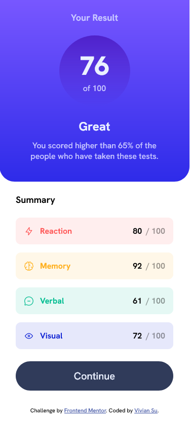
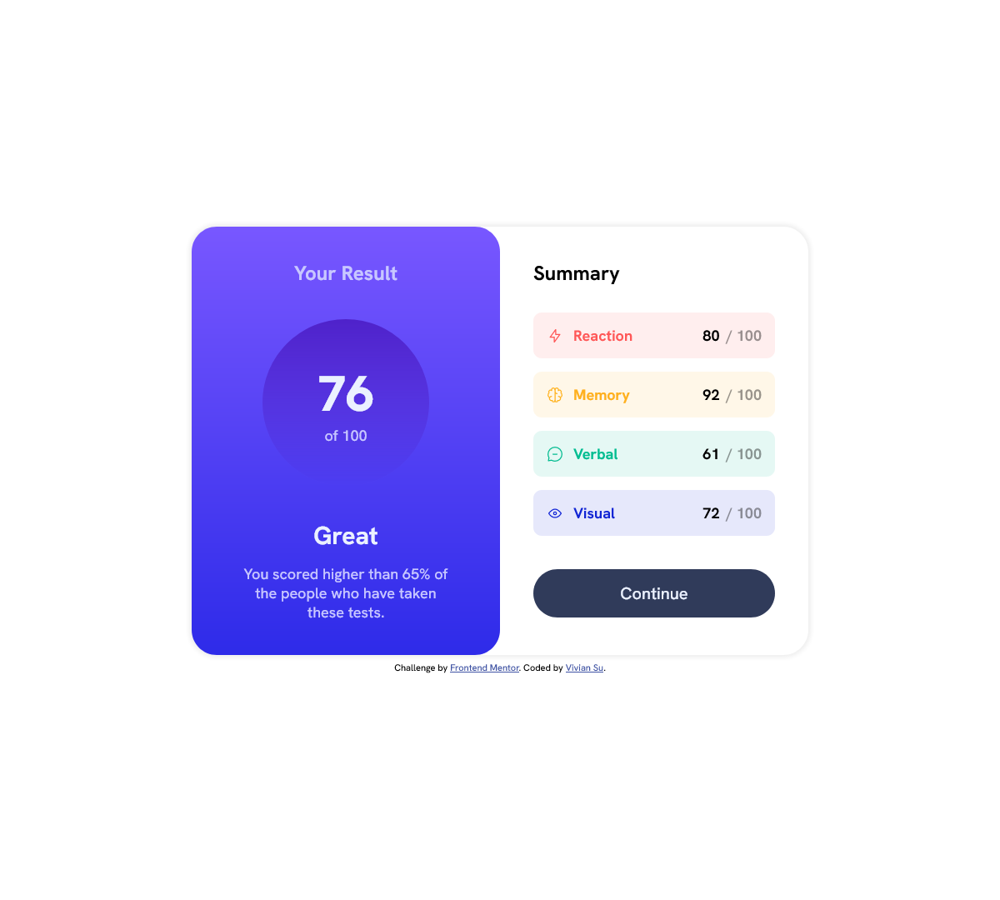

# Frontend Mentor - Results summary component solution

This is a solution to the [Results summary component challenge on Frontend Mentor](https://www.frontendmentor.io/challenges/results-summary-component-CE_K6s0maV). Frontend Mentor challenges help you improve your coding skills by building realistic projects. 

## Table of contents

- [Frontend Mentor - Results summary component solution](#frontend-mentor---results-summary-component-solution)
  - [Table of contents](#table-of-contents)
  - [Overview](#overview)
    - [The challenge](#the-challenge)
    - [Screenshot](#screenshot)
    - [Links](#links)
  - [My process](#my-process)
    - [Built with](#built-with)
    - [What I learned](#what-i-learned)
  - [Author](#author)

## Overview

### The challenge

Users should be able to:

- View the optimal layout for the interface depending on their device's screen size
- See hover and focus states for all interactive elements on the page
- **Bonus**: Use the local JSON data to dynamically populate the content

### Screenshot




### Links

- Solution URL: [https://www.frontendmentor.io/solutions/results-summary-component-using-jquery-and-ajax-_7sA-9gjiF](https://www.frontendmentor.io/solutions/results-summary-component-using-jquery-and-ajax-_7sA-9gjiF)
- Live Site URL: [https://yingjhen-su.github.io/frontend-mentor_results-summary/](https://yingjhen-su.github.io/frontend-mentor_results-summary/)

## My process

### Built with

- Semantic HTML5 markup
- CSS custom properties
- CSS Flexbox
- CSS Grid
- Mobile-first workflow
- [jQuery](https://jquery.com/) - JS library
- Ajax

### What I learned

- Use jQuery to create element
```js
$("")
  .attr("src", s.icon)
  .attr("alt", `${s.category} icon`)
  .appendTo(title);

$('<span class="summary__category"></span>')
  .text(s.category)
  .appendTo(title);
```

- Use jQuery ajax method
```js
$.ajax({
    url: "./data.json",
    type: "GET",
})
.done((json) => {})
.fail((xhr, status, err) => {})
```

## Author

- Frontend Mentor - [@YingJhen-Su](https://www.frontendmentor.io/profile/YingJhen-Su)
